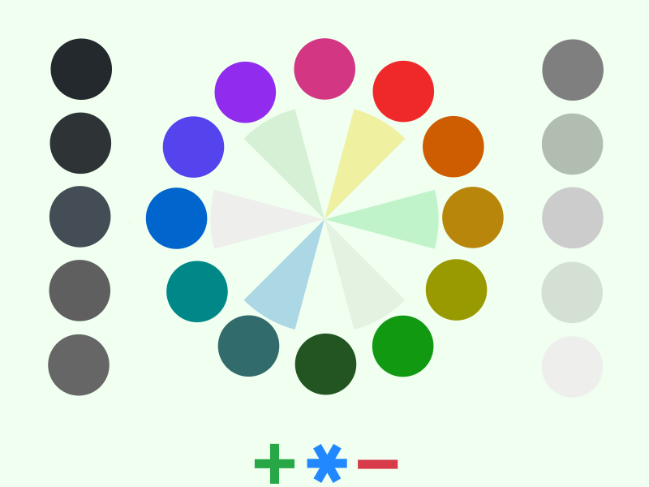

# organic-green color theme

Low-contrast green color theme for Emacs.

## Installation:

```lisp
(package-install 'organic-green-theme)
```

Then in your emacs config somewhere:

```lisp
(load-theme 'organic-green t)
```

## Version 2

Version 1 by default. Set version 2 (experimental & subject to future changes):
```lisp
(setq organic-green-version 2)
```
<p align="center">
  
</p>


## Version 1

You can set all fonts for editing from bold to normal:
```lisp
(setq organic-green-boldless t)
```


## License

Copyright (c) 2009-2023 Kostafey <kostafey@gmail.com>

Distributed under the General Public License 2.0+
